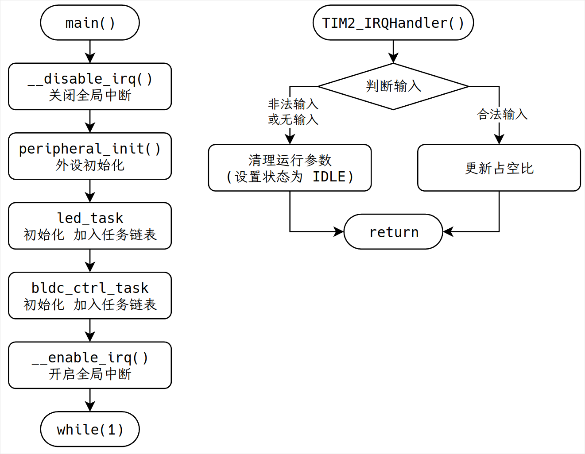
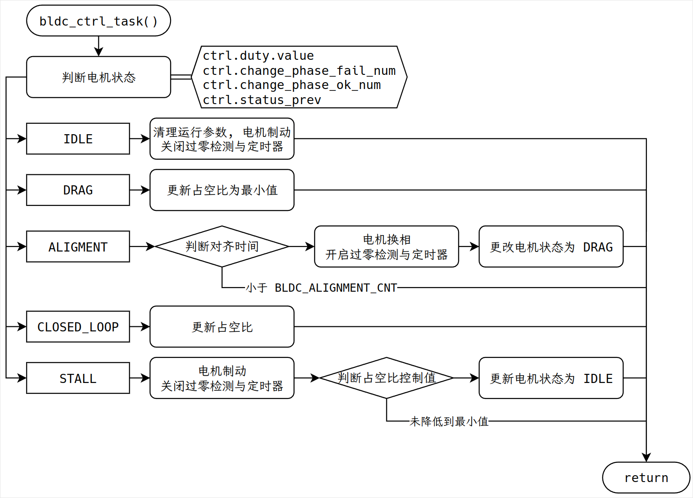
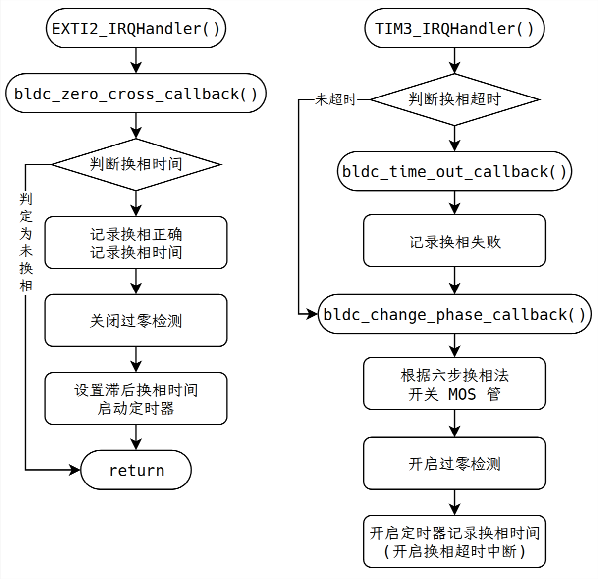

# kabuterimon
~ Sensorless BLDC Control ~

## 项目说明

- [](https://wakatime.com/@bfcd022b-5701-445b-9c00-22ff2d260468/projects/wcmbaigibo)
- 代码仓库: https://github.com/dokee39/kabuterimon
- 立创硬件开源平台: [四合一电调](https://oshwhub.com/colorful-sun/kabuterimon)
    - 四合一无刷电调分为功率板和控制板两部分, 可同时驱动四个无刷电机. 功率板采用了大面积的铜箔与阻焊开窗, 具有很强的过流能力与散热能力, 借助桨叶散热的情况下可持续通过约 ?A 的电流. 为方便调试, 控制板设计为四块小板组成的叠板, 通过插接件与功率板连接, 实现控制代码中的 PWM 输入, 过零检测, 六步换相等功能
- 基于沁恒青稞 RISC-V 通用系列产品 CH32V203F8U6 的无刷电子调速器 (ESC)
- 2024 年全国大学生嵌入式芯片与系统设计竞赛
    - 芯片应用赛道
    - 南京沁恒微电子股份有限公司
    - 无刷电机控制及应用

## 代码结构

本作品中无刷电调模块配套软件实现已在 [github 开源](https://github.com/dokee39/kabuterimon), 适用于基于[沁恒青稞 RISC-V 通用系列产品](https://www.wch.cn/products/productsCenter/mcuInterface?categoryId=70)的无刷电子调速器 (ESC).

项目主控使用 `CH32V203F8U6`, 工具链为 `mounriver-studio-toolchain`, 使用 `Makefile` 进行项目构建, 使用 `openocd-wch-riscv` 与 `WCH-LinkE` 调试器进行代码烧录与调试. 

该项目实现了无刷电子调速器的基本功能, 项目代码精简, 性能可靠, 具有高可读性, 高可维护性等特点. 

代码仓库的结构如下: 
```
.
├── App        // 应用层
│   ├── bldc_callback.c   // BLDC 涉及到的中断回调函数
│   ├── bldc_ctrl.c       // 模式切换与控制值设置的轮询任务
│   ├── bldc_mos_ctrl.c   // MOS 管控制
│   ├── bldc_tim_cnt.c    // 定时器控制
│   ├── bldc_zero_cross.c // 过零检测
│   ├── led_task.c
│   └── inc
│       └── ...
├── Components // 组件
│   ├── support    // 常用数学工具
│   │   ├── user_lib.c
│   │   └── inc
│   │       └── ...
│   └── system     // 基于侵入式链表实现的时间片任务轮询
│       ├── list.c
│       ├── timeslice_task.c
│       └── inc
│           └── ...
├── Core       // 初始化与中断回调
│   ├── ch32v20x_it.c
│   ├── main.c
│   ├── system_ch32v20x.c
│   └── inc
│       ├── ch32v20x_conf.h
│       ├── ch32v20x_it.h
│       ├── main.h
│       └── system_ch32v20x.h
├── Driver     // 驱动
│   ├── CMSIS
│   │   └── ...
│   └── Peripheral
│       └── ...
├── compile_commands.json
├── Link.ld
├── Makefile
├── README.md
└── startup_ch32v20x_D6.s
```

本项目代码主要功能实现在 `App` 文件夹中, 包括 MOS 管控制, 定时器控制, 过零检测, 输入捕获等. `Components/system` 文件夹中实现了一个基于侵入式链表的时间片任务轮询框架, 相比于 `FreeRTOS` 等实时操作系统, 该框架具有更为轻量化, 适用于对实时性要求较高的和任务较少的场合. 在本项目中只有两个任务: LED 控制任务 `led_task` 和无刷电机控制任务 `bldc_ctrl_task`, 可以根据需要添加其他任务. 

在 `main()` 函数中完成全部外设初始化与任务初始化后, 开启中断, 每 100μs 执行一次控制任务 `bldc_ctrl_task`. 在该任务中, 首先判断与设置当前状态, 根据不同状态执行电机制动或更新输出 PWM 的占空比等. 此外, 还需要在相应的中断中执行过零点, 换相, 更新 PWM 输入的回调函数, 具体代码参考 `bldc_callback.c`. 项目使用到的中断有如下几个: 
- `SysTick_Handler()`: 时间片任务轮询使用
- `TIM2_IRQHandler()`: PWM 输入使用
- `TIM3_IRQHandler()`: 超时换相与滞后换相使用
- `EXTI2_IRQHandler()`: 过零检测使用

下面简要介绍相关功能的实现方法:
- 油门 PWM 信号检测: 定时器输入捕获
- 过零检测: 采用虚拟中性点比较器方案, 其中比较器使用了 CH32 系列自带的片上外设, 将比较器的输出接到 PA2 上, 使用外部中断信号作为过零点信号, 具体代码参考 `bldc_zero_cross.c`
- 滞后换相: 通常换相点滞后过零点 30°, 因此需要滞后换相, 在每次换相时开启定时器中断, 在过零点时记录定时器计数值, 并进行滤波后得到换相时间 (`ctrl.step_cnt`), 再次开启定时器延时相应的时间进行换相, 具体代码参考 `bldc_tim_cnt.c`
- 六步换相: 根据 MOS 管状态的不同可将相分为三种: 
    - 上臂导通相: 输出互补的 PWM 波, 上管导通时相当于电源的正极, 当下管导通时制动, 提供回流路径, 防止感应过电压
    - 下臂导通相: 上管闭, 下管开, 相当于电源的负极
    - 浮空相: 上下管均关闭, 通过检测浮空相上电压的来检测感应电动势过零点
    六步换相法按一定的顺序改变 MOS 管的状态来换相, 在本项目中, 使用了 `offset_of()` 宏与 `six_step` 数组来避免各处在换相时大量的 switch case, 精简了代码, 实现代码的高复用性, 具体代码参考 `bldc_mos_ctrl.c`
- 堵转检测: 当换相超时或换相失败时会进行计数, 当超过一定次数则视为堵转
- 电压补偿: 通过片上 ADC 采样采集母线上的电压, 对占空比进行补偿
- 电机起动: 电机起动时首先定位, 将转子对齐到某一相, 随后进行拖动, 拖动时固定占空比为最小值, 换相的时间间隔将随每次过零检测时间记录而自动减小, 当连续成功换相超过一定次数时, 即可认为成功起动, 随即切入闭环, 具体代码参考 `bldc_ctrl.c`


外设相关的宏定义在 `main.h` 文件中, 电机控制相关的宏定义在 `bldc_ctrl.h` 文件中, 以下是电机控制相关的宏定义: 
```c
#define BLDC_DIR                   CW              // 转动方向
#define BLDC_SPEED_MODE            SPEED_OPEN_LOOP // 速度模式

#define BLDC_DUTY_MIN              (200)  // 占空比最小值
#define BLDC_DUTY_MAX              (2000) // 占空比最大值
#define BLDC_DUTY_INC_MIN          (-100) // 占空比最大减小值
#define BLDC_DUTY_INC_MAX          (100)  // 占空比最大增加值

#define BLDC_CHANGE_PHASE_NUM_FAIL (500)  // 判定堵转的换相失败计数值
#define BLDC_CHANGE_PHASE_NUM_DRAG (50)   // 判定拖动成功的换相成功计数值

#define BLDC_STEP_CNT_MIN_ADV      24     // 换向时间小于该比率 (step_cnt / 24) 判定还未换向, 防止电压抖动

#define BLDC_TICK_ALIGNMEN         US_TO_TICK(100000) // 定位对齐时间
#define BLDC_STEP_CNT_DRAG         US_TO_CNT(200)     // 拖动换相时间
#define BLDC_STEP_CNT_MAX          US_TO_CNT(10000)   // 换相最大时间
#if BLDC_STEP_CNT_MAX > 65535
#error BLDC_STEP_CNT_MAX > 65535
#endif
```

电机控制相关的变量由 `ctrl` 结构体统一管理, 其类型声明如下: 
```c
typedef struct bldc_ctrl_ {
    TIM_TypeDef *hTIM_pwm;         // 外设
    TIM_TypeDef *hTIM_cnt;
    TIM_TypeDef *hTIM_input;

    uint16_t GPIO_Pin_EXTI;

    bldc_dir_e dir;                 // 电机方向
    bldc_ctrl_status_e status;      // 电机状态
    bldc_ctrl_status_e status_prev; // 上一次的电机状态

    ramp_int32_t duty;              // 占空比控制值, 使用斜波限制其最值与变化值

    int8_t step;                    // 六步换相的步
    uint32_t change_phase_ok_num;   // 成功换向计数
    uint32_t change_phase_fail_num; // 换向失败计数

    uint32_t step_cnt;              // 换相时间计数值
    uint32_t alignment_cnt;         // 对齐时间计数值

    bldc_speed_mode_t mode;         // 速度模式, 开环或闭环
    float speed;
    float speed_set;
} bldc_ctrl_t;
```

电机状态变量的枚举声明如下: 
```c
typedef enum {
    IDLE = 0,    // 空闲
    ALIGNMENT,   // 定位对齐
    DRAG,        // 拖动
    CLOSED_LOOP, // 闭环转动
    STALL,       // 堵转
} bldc_ctrl_status_e;
```

代码主要执行逻辑见下面的流程图: 





